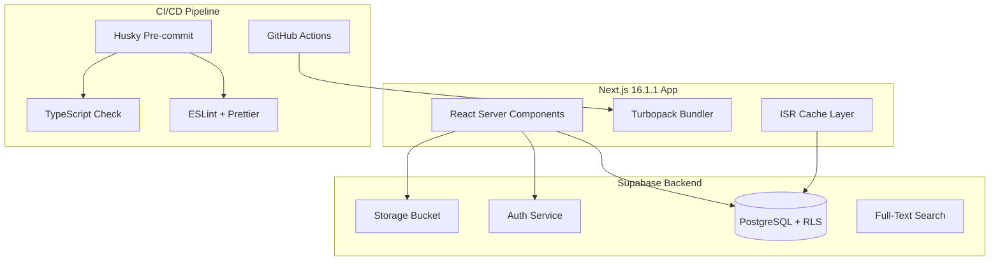

# 4Lebanon Arabic News Website MVP

## Overview

Build a lean, production-ready Arabic (RTL) Lebanese news website inspired by [Lebanon Debate](https://www.lebanondebate.com/) using:

- **Frontend**: Next.js 16.1.1 (Turbopack, React 19.2) + TypeScript + Tailwind CSS
- **Backend**: Supabase (Postgres + Auth + Storage)
- **Deployment**: Vercel
- **CI Enforcement**: Husky + lint-staged for pre-commit hooks
- **Design**: Red/Black/White palette (#830005, #000000, #ffffff)

---

## Design Reference: Lebanon Debate

Based on analysis of [lebanondebate.com](https://www.lebanondebate.com/):

### Color Palette

| Color | Hex | Usage |

| ----------- | --------- | ----------------------------------------- |

| Deep Red | `#830005` | Header, nav bar, footer, buttons, accents |

| Black | `#000000` | Text, logo number "4" |

| White | `#ffffff` | Background, nav text, logo text |

| Gold/Yellow | `#f5c518` | Active nav highlights |

### Layout Components (from Lebanon Debate)

**Header Bar**

- Logo (right side for RTL)
- Date in Arabic
- "مباشر" (Live) button with red badge
- "على مدار الساعة" (Around the Clock) link
- Search input

**Navigation Bar**

- Categories: الأخبار المهمة, رادار, بحث وتحرّي, المحلية, أمن وقضاء, إقليمي ودولي, كتّابنا, اقتصاد, خاص

**Homepage Layout**

- Hero/Featured article with large image
- Live news ticker sidebar "على مدار الساعة" with timestamps
- Article grid by category sections
- "الأكثر قراءة" (Most Read) sidebar
- Writers section with avatars

**Article Page Layout**

- Category breadcrumb
- Author with avatar + date/time
- Large headline
- Share buttons + font size controls (A+/A-)
- Cover image
- Article body (Markdown rendered)
- "اخترنا لكم" (Selected for you) related articles
- Live ticker sidebar

**Footer**

- Logo + social icons (WhatsApp, Telegram, Instagram, YouTube, X, Facebook)
- Multi-column navigation links
- App store badges
- Copyright

---

## Architecture



---

## 1. Project Setup (Next.js 16.1.1)

### Dependencies

```json
{
  "dependencies": {
    "next": "^16.1.1",
    "react": "^19.2.0",
    "react-dom": "^19.2.0",
    "@supabase/ssr": "latest",
    "@supabase/supabase-js": "latest",
    "react-markdown": "^9.x",
    "rehype-sanitize": "^6.x",
    "remark-gfm": "^4.x",
    "date-fns": "^3.x",
    "date-fns-tz": "^3.x"
  },
  "devDependencies": {
    "typescript": "^5.3.0",
    "tailwindcss": "^3.4.x",
    "@types/node": "^20.x",
    "@types/react": "^19.x",
    "eslint": "^9.x",
    "eslint-config-next": "^16.x",
    "prettier": "^3.x",
    "prettier-plugin-tailwindcss": "^0.6.x",
    "husky": "^9.x",
    "lint-staged": "^15.x"
  }
}
```

### Husky + lint-staged Setup

```json
// package.json
{
  "scripts": {
    "prepare": "husky",
    "lint": "next lint",
    "lint:fix": "next lint --fix",
    "format": "prettier --write .",
    "typecheck": "tsc --noEmit",
    "build": "next build"
  },
  "lint-staged": {
    "*.{ts,tsx}": ["eslint --fix", "prettier --write"],
    "*.{json,md,css}": ["prettier --write"]
  }
}
```

```bash
# .husky/pre-commit
pnpm lint-staged
pnpm typecheck
```

---

## 2. File Structure

```
E:\Projects\...\app\
├── app/
│   ├── (public)/
│   │   ├── page.tsx                 # Homepage
│   │   ├── search/page.tsx          # Search results
│   │   ├── section/[slug]/page.tsx  # Section pages (news, analysis, etc.)
│   │   ├── article/[slug]/page.tsx  # Article detail
│   │   └── author/[id]/page.tsx     # Author profile
│   ├── (admin)/admin/
│   │   ├── page.tsx                 # Dashboard
│   │   ├── login/page.tsx           # Auth
│   │   └── articles/
│   │       ├── new/page.tsx
│   │       └── [id]/edit/page.tsx
│   ├── api/revalidate/route.ts
│   ├── layout.tsx                   # Root RTL layout
│   ├── globals.css
│   ├── sitemap.ts
│   ├── robots.ts
│   └── rss.xml/route.ts
├── components/
│   ├── layout/
│   │   ├── header.tsx               # Red header bar
│   │   ├── nav-bar.tsx              # Category navigation
│   │   ├── footer.tsx               # Multi-column footer
│   │   └── live-ticker.tsx          # "على مدار الساعة"
│   ├── article/
│   │   ├── article-card.tsx
│   │   ├── article-grid.tsx
│   │   ├── featured-article.tsx
│   │   └── related-articles.tsx
│   ├── sidebar/
│   │   ├── most-read.tsx
│   │   └── writers-section.tsx
│   ├── ui/                          # Shared primitives
│   └── markdown-renderer.tsx
├── lib/
│   ├── supabase/
│   │   ├── server.ts
│   │   ├── client.ts
│   │   └── middleware.ts
│   ├── utils.ts
│   └── constants.ts
├── types/
│   └── database.ts
├── supabase/
│   └── migrations/
│       ├── 001_schema.sql
│       ├── 002_indexes.sql
│       ├── 003_rls.sql
│       └── 004_seed.sql
├── docs/
│   ├── README_DEPLOY.md
│   ├── PERFORMANCE.md
│   ├── CICD.md
│   └── STACK_AND_COST.md
├── .github/workflows/ci.yml
├── .husky/pre-commit
├── middleware.ts
├── next.config.ts
├── tailwind.config.ts
└── package.json
```

---

## 3. Database Schema

### Tables

| Table | Key Fields |

| ---------------- | --------------------------------------------------------------------------------------------------------------------------------------------------------------------------------------------- |

| `profiles` | id (uuid = auth.users.id), display_name_ar, avatar_url, bio_ar |

| `sections` | id, slug, name_ar (الأخبار, تحليل, etc.) |

| `regions` | id, slug, name_ar |

| `countries` | id, slug, name_ar, region_id FK |

| `topics` | id, slug, name_ar |

| `articles` | id, author_id FK, slug, title_ar, excerpt_ar, body_md, cover_image_path, section_id FK, region_id FK, country_id FK, status, published_at, is_breaking, sources JSONB, search_vector tsvector |

| `article_topics` | article_id, topic_id |

### Performance Indexes

```sql
-- Core query patterns
CREATE INDEX idx_articles_published ON articles (published_at DESC)
  WHERE status IN ('published', 'scheduled') AND published_at IS NOT NULL;
CREATE INDEX idx_articles_breaking ON articles (is_breaking, published_at DESC)
  WHERE is_breaking = true;
CREATE INDEX idx_articles_section ON articles (section_id, published_at DESC);
CREATE INDEX idx_articles_author ON articles (author_id, updated_at DESC);

-- Full-text search (Arabic using 'simple' config)
ALTER TABLE articles ADD COLUMN search_vector tsvector
  GENERATED ALWAYS AS (
    to_tsvector('simple', coalesce(title_ar,'') || ' ' ||
    coalesce(excerpt_ar,'') || ' ' || coalesce(body_md,''))
  ) STORED;
CREATE INDEX idx_fts ON articles USING GIN (search_vector);

-- Trigram fallback
CREATE EXTENSION IF NOT EXISTS pg_trgm;
CREATE INDEX idx_title_trgm ON articles USING GIN (title_ar gin_trgm_ops);
```

### RLS Policies

```sql
-- Public visibility rule
CREATE POLICY "public_read" ON articles FOR SELECT USING (
  status IN ('published', 'scheduled')
  AND published_at IS NOT NULL
  AND published_at <= now()
);

-- Author ownership enforcement
CREATE POLICY "author_crud" ON articles FOR ALL
  USING (author_id = auth.uid())
  WITH CHECK (author_id = auth.uid());
```

---

## 4. Key Components

### Root Layout (RTL + Arabic Font)

```tsx
// app/layout.tsx
import { Noto_Kufi_Arabic } from 'next/font/google'

const font = Noto_Kufi_Arabic({
  subsets: ['arabic'],
  weight: ['400', '500', '700'],
  variable: '--font-arabic',
})

export default function RootLayout({ children }) {
  return (
    <html lang="ar" dir="rtl" className={font.variable}>
      <body className="font-arabic bg-white text-black">{children}</body>
    </html>
  )
}
```

### Tailwind Config (Color Palette)

```ts
// tailwind.config.ts
export default {
  theme: {
    extend: {
      colors: {
        primary: '#830005', // Deep red
        'primary-dark': '#6a0004',
        accent: '#f5c518', // Gold highlight
      },
      fontFamily: {
        arabic: ['var(--font-arabic)', 'sans-serif'],
      },
    },
  },
}
```

---

## 5. Caching Strategy (Next.js 16)

| Route | Strategy | Revalidate |

| ------------------------- | -------- | ---------- |

| Homepage `/` | ISR | 120s |

| Section `/section/[slug]` | ISR | 180s |

| Article `/article/[slug]` | ISR | 600s |

| Search `/search` | Dynamic | No cache |

| Author `/author/[id]` | ISR | 300s |

| RSS `/rss.xml` | ISR | 300s |

| Sitemap `/sitemap.xml` | ISR | 3600s |

| Admin `/*` | Dynamic | No cache |

**On-Demand Revalidation**: Admin publish action triggers `revalidatePath()` for affected routes.

---

## 6. CI/CD Pipeline

### GitHub Actions ([`.github/workflows/ci.yml`](.github/workflows/ci.yml))

```yaml
name: CI
on: [push, pull_request]
jobs:
  check:
    runs-on: ubuntu-latest
    steps:
      - uses: actions/checkout@v4
      - uses: pnpm/action-setup@v4
      - uses: actions/setup-node@v4
        with: { node-version: '20', cache: 'pnpm' }
      - run: pnpm install --frozen-lockfile
      - run: pnpm typecheck
      - run: pnpm lint
      - run: pnpm build
```

### Husky Pre-commit

Enforces lint + typecheck locally before any commit reaches remote.

### Vercel Integration

- Preview deploys on PR
- Production deploy on merge to `main`
- Environment variables per environment

---

## 7. Navigation Structure (Arabic)

Based on Lebanon Debate, adapted for 4Lebanon:

| Arabic | English | Route |

| ------------------ | ------------- | ---------------------- |

| الصفحة الرئيسية | Homepage | `/` |

| أخبار عاجلة | Breaking News | `/section/breaking` |

| تحليل | Analysis | `/section/analysis` |

| الجغرافيا السياسية | Geopolitics | `/section/geopolitics` |

| كتّابنا | Our Writers | `/authors` |

| بحث | Search | `/search` |

---

## 8. Documentation Deliverables

| Document | Content |

| -------------------------------------------------- | --------------------------------------------------- |

| [`docs/README_DEPLOY.md`](docs/README_DEPLOY.md) | Supabase setup, migrations, env vars, Vercel deploy |

| [`docs/PERFORMANCE.md`](docs/PERFORMANCE.md) | Caching strategy, revalidation, scaling notes |

| [`docs/CICD.md`](docs/CICD.md) | GitHub Actions, Husky, Vercel flow, migrations |

| [`docs/STACK_AND_COST.md`](docs/STACK_AND_COST.md) | Monthly cost breakdown |

---

## 9. Cost Estimates

| Service | Free Tier | Production |

| ----------------- | --------------- | ----------- |

| Vercel | Hobby (limited) | Pro ~$20/mo |

| Supabase | Free (pauses) | Pro ~$25/mo |

| Domain | - | ~$10/yr |

| Email (4 boxes) | - | ~$42-84/yr |

| **Monthly Total** | ~$0 | ~$50-70/mo |

---

## Implementation Order

1. Scaffold Next.js 16.1.1 project with Turbopack
2. Configure Husky + lint-staged pre-commit hooks
3. Set up Tailwind with red/black/white palette
4. Create Supabase migrations (schema + indexes + RLS + seed)
5. Implement Supabase SSR auth utilities
6. Build layout components (header, nav, footer, ticker)
7. Implement public pages with Lebanon Debate-inspired design
8. Implement admin area with article editor
9. Add SEO (sitemap, RSS, metadata)
10. Configure caching + on-demand revalidation
11. Create GitHub Actions CI workflow
12. Write documentation
